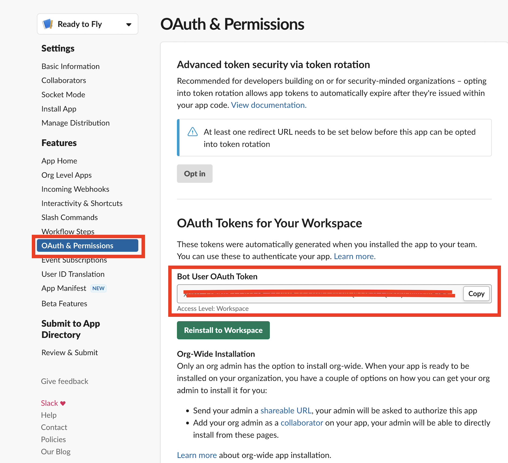
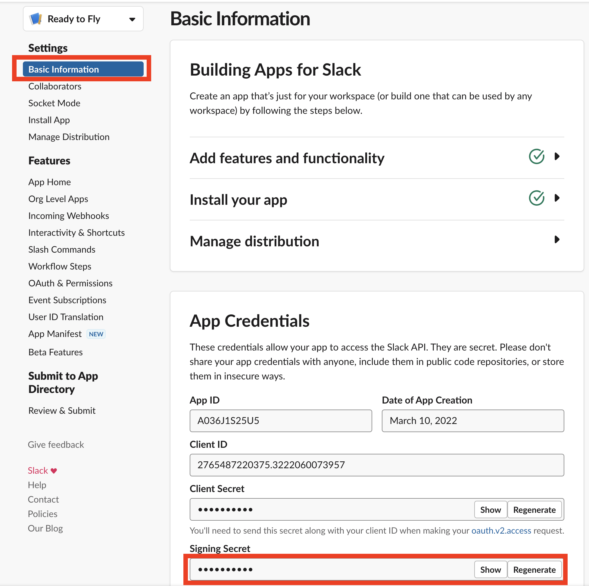
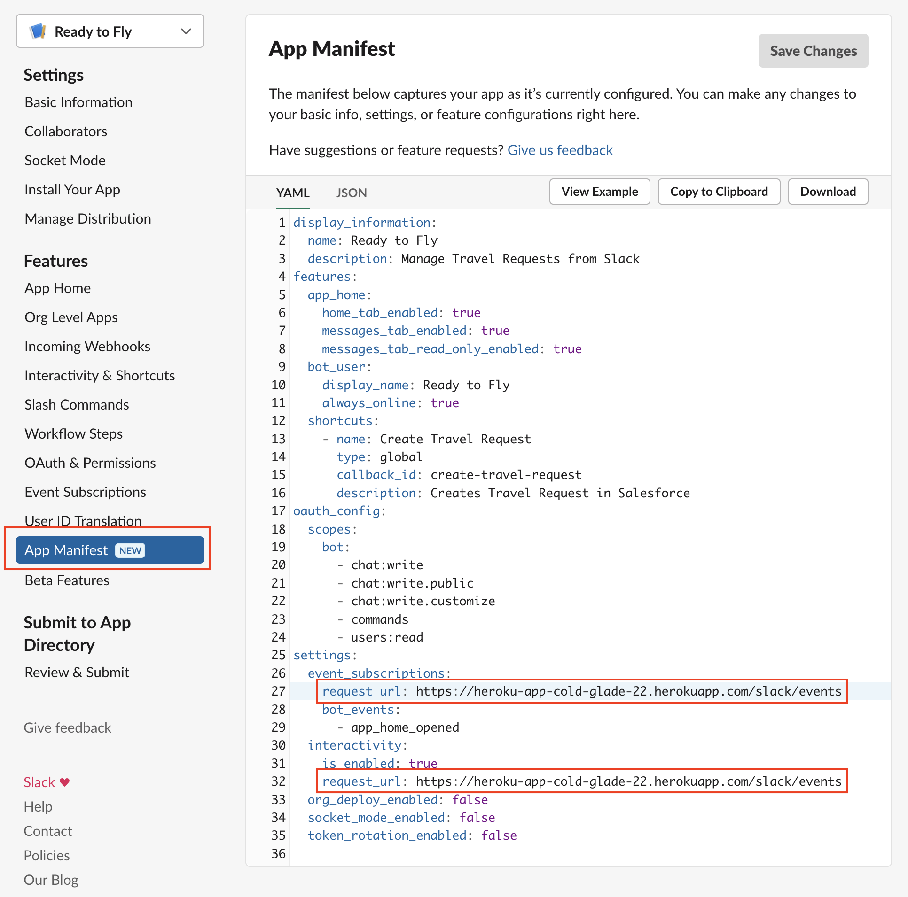

# Ready to Fly

[](https://github.com/trailheadapps/ready-to-fly/actions?query=workflow%3ACI) [](https://codecov.io/gh/trailheadapps/ready-to-fly)


Sample app to showcase Slack + Salesforce integrations.

This app has been created using the [Salesforce Slack Starter Kit](https://github.com/developerforce/salesforce-slack-starter-kit). For a detailed explanation of the app architecture and the scaffolding script, take a look at Salesforce Slack Starter Kit's README.

## Prerequisites

To be able to run this project you will need:

-   A brand new [Trailhead Playground](https://trailhead.salesforce.com/content/learn/modules/trailhead_playground_management), or sign up for a [free Developer Edition org](https://developer.salesforce.com/signup).
    -   Optional: If you want to use scratch orgs follow the [instructions](https://help.salesforce.com/articleView?id=sfdx_setup_enable_devhub.htm&type=5) to enable Dev Hub in your Salesforce Developer Org.
-   A new Slack workspace. You will need to create this workspace through a personal Slack account. (instructions [here](https://slack.com/help/articles/206845317-Create-a-Slack-workspace))
-   Heroku account ([signup](https://signup.heroku.com))
-   `git` >= 1.22 (download [here](https://git-scm.com/downloads))
-   `node` >= 14 (download [here](https://nodejs.org/en/download/))
-   `sfdx` CLI >= sfdx-cli/7.142.0 (download [here](https://developer.salesforce.com/tools/sfdxcli))
-   `heroku` CLI (download [here](https://devcenter.heroku.com/articles/heroku-cli))

## Setup Steps

### Configuring Slack app at api.slack.com

1. Open [https://api.slack.com/apps/new](https://api.slack.com/apps/new) and choose **From an app manifest**
2. Select the workspace you created in the Prerequisites section
3. Copy the contents of [manifest.yml](./apps/ready-to-fly/manifest.YAML) into the text box that says **Enter app manifest below** and click _Next_
4. Review the configuration and click _Create_
5. In _Basic Information_ scroll down to the _Display Information_ section. Upload a picture for the app. You can use [this logo](./airplaneLogo.png)
6. Now click _Install App_ on the left menu. Then click the _Install to Workspace_ button and then click on _Allow_

### Deploying the app using a Salesforce Non-scratch org (or a Trailhead Playground) and Heroku

1. Clone the ready-to-fly repository

```
git clone https://github.com/trailheadapps/ready-to-fly
```

2. Authenticate to your Salesforce org and set as default:

```
sf org login web --set-default -a mydevorg
```

3. Login to your Heroku Account

```
heroku login
```

4. Run Deployment Script

```
cd ready-to-fly/scripts
npm install
cd ..
node scripts/deploy.js
```

5. Choose **Non-Scratch Org** when the script prompts you to select Salesforce environment

6. Click Enter to accept the Heroku app name

7. The script prompts you to enter value for `SLACK_BOT_TOKEN`. To enter this value open your apps configuration page by first navigating to the [apps list](https://api.slack.com/apps) and then selecting the app you created in previous section, click _OAuth & Permissions_ in the left hand menu, then copy the value in _Bot User OAuth Token_ and paste into terminal.



8. The script prompts you for slack signing secret `SLACK_SIGNING_SECRET`. To enter this value open your apps configuration page by first navigating to the [apps list](https://api.slack.com/apps) and then selecting the app you created in previous section, click _Basic Information_ and scroll to the section _App Credentials_ and click show button and copy the _Signing Secret_ and paste into terminal.



### Deploying the app using a Salesforce scratch org and Heroku

1. Clone the ready-to-fly repository

```
git clone https://github.com/trailheadapps/ready-to-fly
```

2. Authenticate to your Salesforce org that has DevHub enabled

```
sf org login web --set-default-dev-hub -a DevHub
```

3. Login to your Heroku Account

```
heroku login
```

4. Run Deployment Script

```
cd ready-to-fly/scripts
npm install
cd ..
node scripts/deploy.js
```

5. Choose **Scratch Org** when the script prompts you to select Salesforce environment

6. Click Enter to accept the Heroku app name

7. The script prompts you to enter value for `SLACK_BOT_TOKEN`. To enter this value open your configuration page by first navigating to the [apps list](https://api.slack.com/apps) and then selecting the app you created in previous section, click _OAuth & Permissions_ in the left hand menu, then copy the value in _Bot User OAuth Token_ and paste into terminal.


8. The script prompts you for slack signing secret `SLACK_SIGNING_SECRET`. To enter this value open your apps configuration page by first navigating to the [apps list](https://api.slack.com/apps) and then selecting the app you created in previous section, click _Basic Information_ and scroll to the section _App Credentials_ and click show button and copy the _Signing Secret_ and paste into terminal.


Note: As ready to fly performs calls from Salesforce to Slack, we've modified the Salesforce Slack Starter Kit script to deploy a named credential and a custom metadata type record used for callouts. We've also included the setup of some sample data.

### Setting Heroku Instance in your Slack App

This is the final step, you will need to enter the current Heroku Instance url in Slack App.

1.  To enter this value open your apps configuration page from [apps list](https://api.slack.com/apps) and then selecting the app you created in previous section, click _App Manifest_. Find the `request_url` fields (there will be two to update) in the manifest and modify it to replace `heroku-app` with your actual heroku domain name obtained from step 6 in previous section. Note at the end of this step your url should look like `https://<heroku-domain>.herokuapp.com/slack/events`.



2.  Once you have done that, you'll be prompted to verify the events endpoint. Scroll to the top of page and click on 'verify'. You're ready to navigate to the app home!

## How to Build and Deploy Code

### Building Salesforce app using a Scratch Org

-   For Salesforce metadata synchronization use `sf project retrieve start` to retrieve and `sf project deploy start` to deploy metadata from orgs to local project folder `force-app`

### Building Salesforce App Using Non-Scratch Org

-   For Salesforce metadata synchronization in developer orgs use `sf project retrieve start -d force-app/main/default` to retrieve and `sf project deploy start -d force-app/main/default` to deploy metadata from orgs to local project folder `force-app`

### Building and deploying Bolt Node.js app

-   For the Bolt Node.js app use the steps below:
    -   cd into apps/ready-to-fly folder `cd apps/ready-to-fly`
    -   add git remote to app repo using `heroku git:remote -a <heroku app name>`
    -   run `git push heroku main` to push code to Heroku

## Local Development

1. To use ngrok, first install it downloading the executable or with npm:

```console
$ npm install ngrok -g
```

2. Next you’ll have to [sign up](https://dashboard.ngrok.com/get-started/setup).
3. Once logged in, navigate to “Setup & Installation“ and copy your auth token.
4. Then set your auth token in your local machine:

```console
$ ngrok authtoken my_auth_token
```

5. Run the ngrok tunnel as follows:

```console
$ ngrok http 3000
```

6. Copy the ngrok tunnel URL to the following places:

-   Your manifest file request URLs
-   The HEROKU_URL environment variable in your .env file
-   The Callback URL for the connected app that’s used for authorization in Salesforce - simply add the ngrok URL in a new line
-   Modify the boltApp named credential to contain the ngrok URL, as it’s the one that we use to callout from Salesforce to Slack

7. Now you are prepared to run the app locally! In another terminal different from the one in which you’re running ngrok, execute `node app.js` from the project folder. You can then make changes to the code and restart the app as many times as you want.

### Note about Managers DropDown Input

The Managers dropdown that appears when you create a travel request is populated with information pulled from Salesforce. Concretely, we look at the standard Manager field on the User object and pull two levels of Managers in the hirerachy. You can change that behavior to adapt it to your needs.
